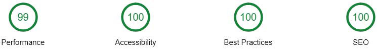

# Portfolio-Pink

The design was created by the [HTML Academy](https://htmlacademy.ru), coded by me.

## [Portfolio-Pink on the GitHub Pages.](https://comp0te.github.io/Portfolio-Pink/)

## Table of contents:
- [Used technologies.](#used-technologies)
- [Chrome DevTools Audits.](#chrome-devtools-audits)

### Used technologies.

In the process of creating the site, I used the following technologies, tools, etc:

- **HTML5:**
	- Semantic.
	- Valid.
	- Accessible:
		- Correct HTML tags.
		- Accessibility from the keyboard.
		- WAI-ARIA for the visually impaired.
- **CSS3:**
	- Responsive (`@media` for mobile, tablet and desktop).
	- Preprocessor: SASS (SCSS).
	- Methodology: BEM.
	- `Flexbox` and progressive enhancement to `Grid`, etc.
	- Pixel perfect.
- **JavaScript:**
	- TypeScript.
	- ES2015, Promise, Fetch API, REST.
  - Object-oriented programming.
  - Page functionality:
    - Menu on the mobile and tablet views.
    - Index.html:
      - Carousel: mouse, keyboard and touch controls.
        - Carousel of comments users.
        - Carousel of table columns in mobile view.
      - Google Maps JavaScript API.
    - Photo.html:
      - Generation of posts using a `<template>` after `GET` request to the server.
      - Lazy display of posts.
      - Estimating posts with an optimized number of `PUT` requests to the server.
      - Select a file with Drag'n'Drop, preview selected file.
      - Crop and fill sliders for uploaded file.
      - Tabs of sliders in mobile view.
      - Form validation.
    - Contest.html
      - Form validation.
- **Graphics:**
	- Retina 2x, SVG sprite `<use>` with external source.
	- Progressive enhancement to WebP.
  - Optimized, responsive, lazy download.
- **Cross-browser support:**
	- The last 2 versions of the main browsers.
- **Tools:**
	- Package manager: Yarn.
	- Task runner: Gulp 4.
	- Module loader: Webpack 4.
	- Linters:
		- EditorConfig.
		- HTMLHint.
		- Stylelint.
		- TSLint.
	- Git, GitHub, Travis CI.
	- Basic terminal usage.
	- Visual Studio Code, Chrome DevTools, Adobe Photoshop.

---

### Chrome DevTools Audits:

- Chrome v. 68.0.3440.106
- Device: Mobile
- Throttling: Applied Fast 3G, 4x CPU Slowdown

**Index.html**

**Photo.html**

**Contest.html**

---
